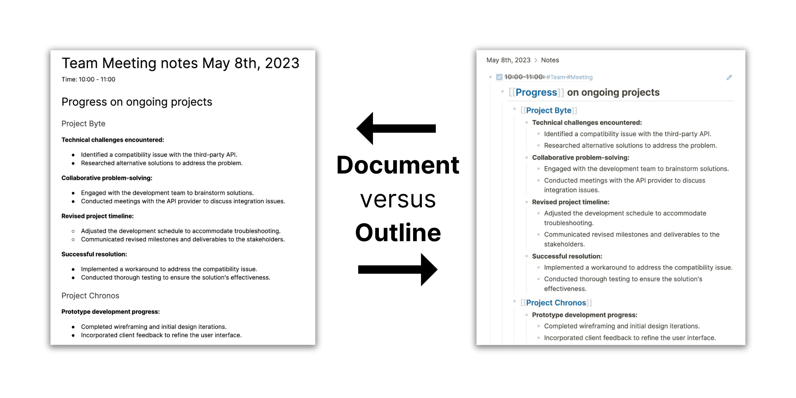

Logseq has many features. When you just get started , you may feel that you need to understand all of them. But, you need less than a handful of features to start getting value from using Logseq.

In this part of the onboarding guide, we’ll have a brief look at Logseq’s core concepts:

* Blocks
* Pages
* References

Confused about what these words mean? Let’s define things:

### Blocks are like paragraphs
Whenever you open Logseq, you always start on the journals section. This is a list of all of your journals pages, showing the most recent date first. In a bit we’ll explain what these pages do exactly, but first we need to take a moment to understand a fundamental concept in Logseq: **blocks**.

On that page with today’s date, you see a single bullet. This is called a _block_ in Logseq, and it’s the smallest piece of information you can work with in this app. You can compare blocks to paragraphs in a regular text editor.

To group multiple blocks (paragraphs) that are related to each other, you create _branches_ in Logseq. In a regular text editor this would be a subheading with multiple paragraphs.

In the next chapter of this guide we’ll dive deep into blocks and branches, and why they’re so useful compared to regular text documents.

### Pages are collections of blocks
We already mentioned them: journals. But what are these random pages with dates?

Every time you open Logseq, it will open on the journal page for that day. It does this to give you a place to quickly capture notes.

And best of all: every block and branch you put on a journal page is automatically tagged with that date, giving you at least one way to find back your notes (we’ll dive much deeper into this in the chapter about references).

But you don’t have to write everything on a journal page. Logseq gives you several options to create so-called _titled pages_. You can give these pages any title you want, and many people use pages to group related notes.

We’ll go into more detail about recommended workflows for journals and titled pages later in this guide.

### References let you link pages and blocks
Also called just _links_, page references point to pages (either journals or titled pages). On the other hand, block references point to single blocks.

Clicking on a page reference will take you to its page and show all of the contents of that page:

<video width="100%" controls>
  <source src="./assets/2_2_ClickPageRef.mp4" type="video/mp4">
</video>

Clicking on a block reference will show all of the contents of its branch inline:

<video width="100%" controls>
  <source src="./assets/2_3_ClickBlockRef.mp4" type="video/mp4">
</video>

Towards the end of this guide we’ll have a look at how to use references to search and navigate your notes.

For now, [let’s first have a closer look at blocks](./3.write-in-blocks-and-branches).
