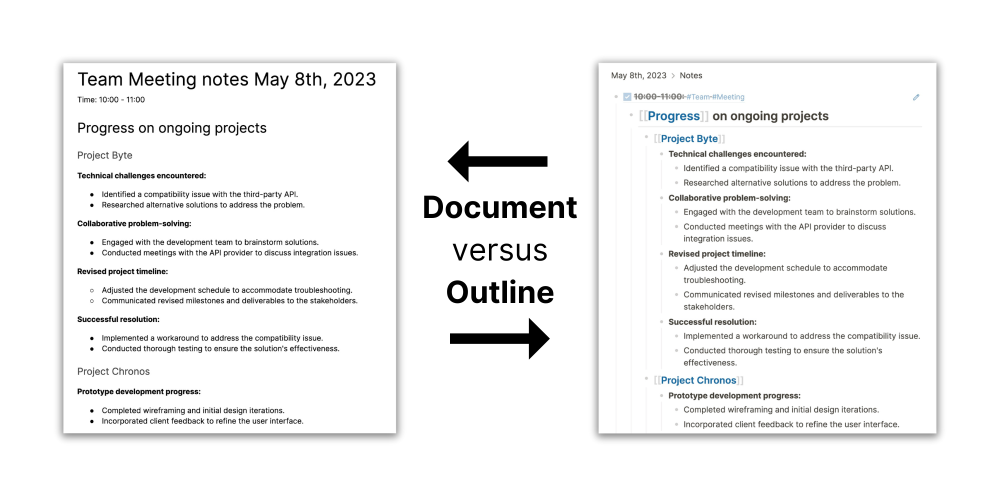

As we mentioned before, the _block _is the smallest piece of information you work with in Logseq. Blocks are like paragraphs, and you can recognize them by the bullet in front of them.

To group multiple blocks (paragraphs) that are related to each other, you create _branches_ in Logseq. In a regular text editor this would be a subheading with multiple paragraphs.

Here’s the example that we showed in the previous article of this guide, hopefully it makes more sense every time you see it:

Before you can fully benefit from writing in outlines, you need to know a few core terms. You already know what blocks and branches are, but what about the other parts of an outline?

Yes, outlines consist of more than blocks and branches. For example, each branch has _parent-child_ relationships, and often blocks within a branch have other _sibling blocks_.

What does this all mean? Let’s define all the parts of the outline. Don’t bother memorizing these terms, we’re putting them here for reference:

1. **Blocks** are paragraphs, and collections of blocks form _branches_.
2. **Branches** are subsections of pages, they’re created by _indenting_ blocks.
3. **Indentation** is when you place one block underneath another (using the `Tab` key), creating a _parent-child relationship_.
4. **Parent blocks** are the top block of a branch, and parent blocks have one or multiple _child blocks_.
5. **Child blocks** are blocks that are indented underneath a parent block, and child blocks can have one or more _sibling blocks_.
6. **Sibling blocks** are blocks that are are on the same indentation level under the same parent.

Before putting these concepts into practice, let’s quickly have a look at why writing your notes in this way is so useful.

### Benefits of writing in blocks and grouping them in branches
We’ve talked quite a bit about blocks and branches already, but why would you bother writing your notes in an outline format at all? Isn’t it just easier to write in a linear fashion, like any regular text editor?

We believe outliners have much more power that normal document-style writing, because:

#### Benefit 1: Blocks make it easy to organize and connect ideas
Blocks are like paragraphs, but they’re much more powerful than simple text. In Logseq, you can easily move blocks elsewhere. You can also link to blocks from other blocks. In the part about block references we’ll dive deep into this powerful feature.

<video width="100%" controls>
  <source src="./assets/3_3_MoveBlockKb.mp4" type="video/mp4">
</video>

#### Benefit 2: Indentation makes it easy to see the relationship between ideas
So we’ve already hinted at linking blocks. But the easiest way to associate two blocks is by indenting one underneath the other. Branches create a simple relationship between two pieces of information, making them the perfect feature to group related thoughts and give them structure.

<video width="100%" controls>
  <source src="./assets/3_4_IndentKb.mp4" type="video/mp4">
</video>

#### Benefit 3: Expanding and collapsing branches helps to make your notes skimmable
Most text editors allow you to write in outlines, but in Logseq outlines have real power. Not only can you group blocks in branches, you can also hide most of the branches by collapsing (hiding) them. In Logseq it’s easy to only see the information that you need in the moment.

<video width="100%" controls>
  <source src="./assets/3_5_CollapseExpand.mp4" type="video/mp4">
</video>

#### Benefit 4: Zooming into branches gives you a distraction-free writing environment
Another way to remove distractions is by zooming into blocks. When you click on a bullet of a block, Logseq will only show that block and its children. This removes more noise than collapsing a block, giving you a distraction-free writing environment.

<video width="100%" controls>
  <source src="./assets/3_6_ZoomInOut.mp4" type="video/mp4">
</video>

### How to create blocks and branches, and what are best practices for creating branches?
To create a new block while you’re typing in another block, you only need to press the `Enter` key on your keyboard. When your cursor is at the end of a block, pressing `Enter` will create a new empty block. If there’s content after the cursor, pressing `Enter` will move that content into a new block.

<video width="100%" controls>
  <source src="./assets/3_7_EnterEmptyBlock.mp4" type="video/mp4">
</video>

<video width="100%" controls>
  <source src="./assets/3_8_EnterFilledBlock.mp4" type="video/mp4">
</video>

Another way to create a new block is by clicking underneath the last block on a page. When you hover underneath the last block, you’ll see a `+` icon appear at the left-hand side. Clicking will create a new block without an indentation level and put the cursor in it, ready to type.

<video width="100%" controls>
  <source src="./assets/3_9_AddBlockMouse.mp4" type="video/mp4">
</video>

To indent blocks and create branches, hit the `Tab` key when your cursor is in a block. This will move the block to the right, indenting it underneath the block directly above it. This creates the so-called _parent-child relationship_.

Indentation only works when two blocks are on the same indentation level; if the block with your cursor is already indented, pressing `Tab` does nothing.

<video width="100%" controls>
  <source src="./assets/3_4_IndentKb.mp4" type="video/mp4">
</video>

Another way to indent blocks is by left-clicking and holding the bullet, and dragging the block underneath another block. If a block has child blocks, dragging it will move the whole branch.

<video width="100%" controls>
  <source src="./assets/3_10_IndentMouse.mp4" type="video/mp4">
</video>

To _unindent _a block (or branch), you can use the `Shift + Tab` keyboard combination, or drag the block with your mouse.

<video width="100%" controls>
  <source src="./assets/3_11_UnindentKb.mp4" type="video/mp4">
</video>

<video width="100%" controls>
  <source src="./assets/3_12_UnindentMouse.mp4" type="video/mp4">
</video>

Writing your notes in blocks and branches may feel strange in the beginning. But trust us: the more you practice writing in outlines, the more natural it will feel. Soon, you won’t imagine ever writing your notes in another way.

Let’s now zoom out from blocks and branches and have a look at the bigger pieces of information in Logseq: journals and pages.