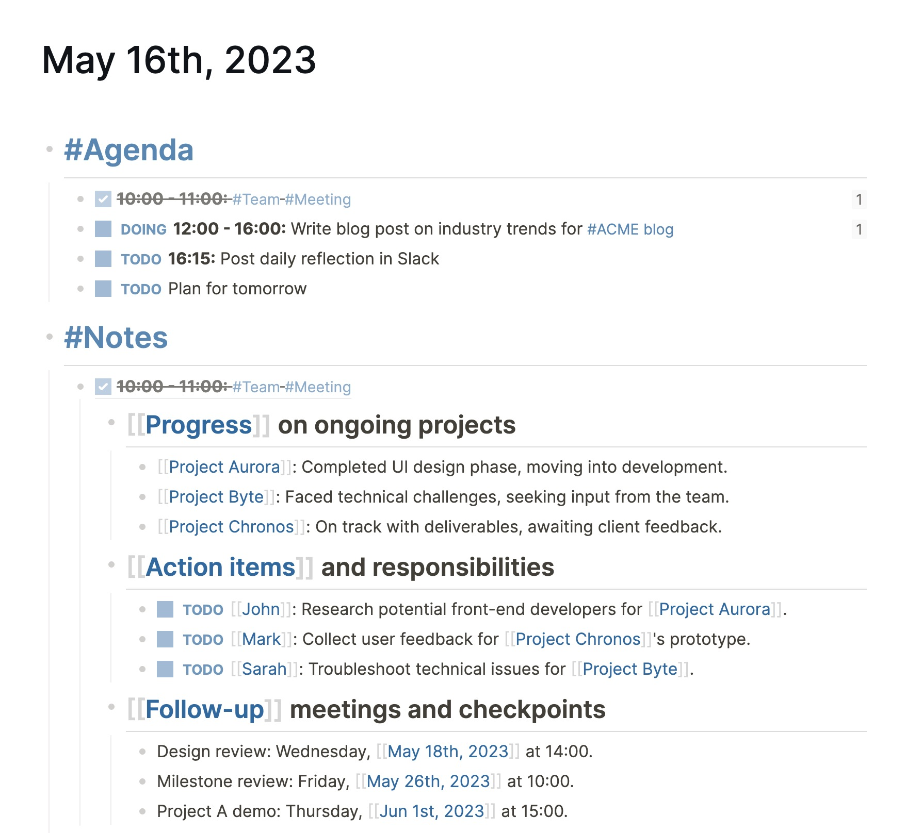

If you've been reading this onboarding series up to now, you’ve seen us mention journals a few times. These dated pages are the _log _in Logseq, as they’re the ideal page to log your daily notes and tasks.

A new journal page is added every day that you open Logseq. They're like a digital agenda, giving you a scratchpad for the day. For example, when you have a meeting, the notes about that meeting would fit perfectly on the journal page. The same goes for tasks that you need to remember or do in the future.

Although we generally will not tell you how to work in Logseq, we strongly encourage new users to put most of their notes on each day’s journal page. This removes the question: “_where should I store this?_”

Maybe it feels scary to put all your notes on a slowly “disappearing” page and you’re afraid that you’ll lose track of your notes. But as you take notes this way, you’ll soon discover that it really doesn’t matter where you store your notes in Logseq—as long as you write in outlines and link them.

But before we dive into linking notes, let’s have a brief look at the other type of pages in Logseq: titled pages.

### When and how to use titled pages
We really do not want to impose a way of working with Logseq, but talking to many users we’ve seen some best practices when it comes to using journals and titled pages.

Titled pages, or just “pages”, are created by you. This is in contrast to journal pages, which are created automatically by Logseq. When creating a titled page, you need to give it a title which lets you reference it later.

To create a page, you have three options:

* Using the search bar
* Using a hashtag
* Using double brackets

When creating a page using the search bar, you’re taken immediately to the page. However, creating a new page this way will not link it in any way, making it less likely you’ll find it back later. In the next section about references you’ll see why this is important.

The other way to create a page is by typing a `#hashtag` or `[[double brackets]]`. This creates the page and a reference (link) to it. You’ll soon see why this is powerful.

Where the journals are the perfect scratchpad or “dumping ground” for most of your notes, titled pages are ideal to put your more refined and structured notes. Many users (the Logseq team included) start notes on the journals page and then at some point move them to dedicated pages. For example, the Logseq team has pages for specific projects, but also very long meetings with detailed notes get their own page. In the next article we show exactly how to move blocks and branches between pages.

Again, it really doesn’t matter where you store your notes in Logseq. If you prefer to create a page for everything, that is absolutely fine. However, to save yourself some thinking, we recommend to first write notes on the journal page and then move them to a dedicated page as the need arises.

But for this workflow to work, you need to understand bi-directional linking. That’s the topic of the next—and last—article of this onboarding guide: **references**.