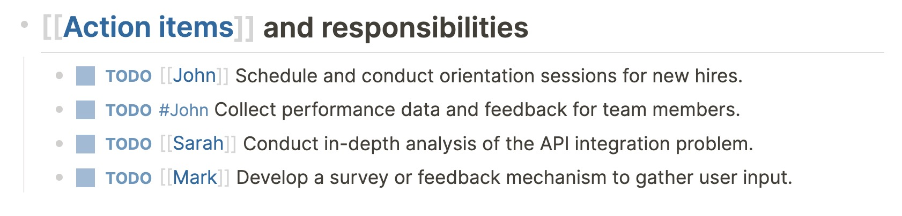
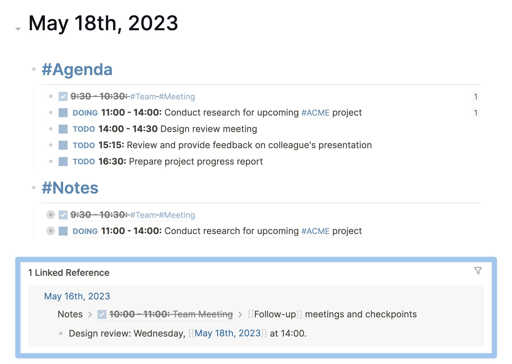

We’ve hinted at it before, but this is probably Logseq’s most powerful feature: links. Or as they’re called in Logseq: **page _references_** and **block _references_**.

References are how you connect notes that are in different pages (be it journal or titled) or in different branches. Because of links, it doesn’t matter where you put your notes in Logseq—provided that you indent and link them.

But what’s the difference between page references and block references? And when should you use which?

### Page references
Page references are the `#hashtags` and `[[bracket links]]` that we mentioned before. Most users will refer to them as just “tags” and “links”.

Both tags and links point to the page that you mention after the hashtag or between the double brackets. If the page doesn’t already exist, referencing it will also create it.

When should you use tags and when should you use bracket links? The difference is mostly aesthetic (both point to a page), although hashtags can only contain _one_ word (and no spaces) whereas bracket links can contain as many spaces and special characters as you like.

In the screenshot above, both `[[John]]` and `#John` point to the same page.

Whenever you link to a page using a tag or a bracket link, the block containing that link will appear in the page’s _Linked References _section.

The Linked References section is _bi-directional linking _in action; whenever you link something, it will actually create **two** links: one from the source to the destination, and one from the destination to the source. This way, you can easily see all instances that you linked to a page.

<video width="100%" controls>
  <source src="./assets/5_2_ShowLinkedRefs.mp4" type="video/mp4">
</video>

The Linked References section is the perfect place to look for notes that are related to each other. Many users treat the Linked References section as a type of inbox, and drag (using their mouse) relevant blocks and branches to the page itself.

<video width="100%" controls>
  <source src="./assets/5_3_DragBlockFromLinkedRefs.mp4" type="video/mp4">
</video>

Another use case of Linked References are to “send” blocks to a future date. Whenever you put a link to a date in a block, that block shows up in the Linked References section of that date:

### Block references
While linking to pages will come in handy a lot, you can’t use page references to link to a specific part on the page. For that, you need block references.

To reference a block, you have three options:

**Option 1:** Using a keyboard shortcut while the cursor is in a block (`Ctrl + C` on Linux and Windows, or `Cmd + C` on Mac):

<video width="100%" controls>
  <source src="./assets/5_5_CopyBlockRefKb.mp4" type="video/mp4">
</video>

**Option 2:** `Right-Click` on a block’s bullet and select the option `Copy block ref` : 

<video width="100%" controls>
  <source src="./assets/5_6_CopyBlockRefMouse.mp4" type="video/mp4">
</video>

**Option 3:** Search for a block by typing `((double parentheses))` and then a word or phrase that’s in the block you wish to reference:

<video width="100%" controls>
  <source src="./assets/5_7_CopyBlockRefParentheses.mp4" type="video/mp4">
</video>

Just like pages have Linked References, so do blocks have a section showing all links to it. Whenever you reference a block, its _block reference counter_ in the right margin will increase. Clicking this counter will show all links to that block (it’s effectively the _Linked References_ of that block):

<video width="100%" controls>
  <source src="./assets/5_8_ClickBlockRef.mp4" type="video/mp4">
</video>

Whenever you reference a block, only the block itself is visible (not its children). However, there is a way to reference an entire branch or even entire pages and showing their contents within another block: using embeds.

### Embeds
While page and block references only show part of the content (either the page title or the contents of one block), embeds show the full context.

Whenever you embed a page, that page’s full contents will be displayed in the block where you put the embed. In the same way, embedding a block will not only show its contents, but also all of its child blocks.

To create a page embed, all you need to type is `/embed`, select the `Page embed` option, and hit `Enter` on your keyboard. Next, type the name of the page you wish to embed:

<video width="100%" controls>
  <source src="./assets/5_9_PageEmbed.mp4" type="video/mp4">
</video>

To create a block embed, you have two options. The first option is similar to embedding a page, but this time you select the option `Block embed` from the trigger menu. Between the double parentheses you type a search term to find the block you wish to embed. Once found, hit `Enter` on your keyboard to embed the block and its children (if it has them):

<video width="100%" controls>
  <source src="./assets/5_10_BlockEmbedFromMenu.mp4" type="video/mp4">
</video>

Another way to embed a block is by right-clicking its bullet and selecting the `Copy block embed` option. This will copy the block’s ID to your clipboard, so you can paste it anywhere you want:

<video width="100%" controls>
  <source src="./assets/5_11_BlockEmbedFromBlock.mp4" type="video/mp4">
</video>

Apart from showing the full context, embeds also allow you to edit blocks and pages directly from the embed. This is not possible with page and block references, and you’d have to go to the source page or block to change its contents.

### Best practices for linking
Before we move onto the recap of this entire onboarding guide, let’s take a moment to consider when to use page and block references, and when to go with embeds.

Most Logseq users turn mentions of people, projects, companies, and other nouns into links (either tags of bracket links). Combined with Logseq’s outline structure, linking enables you to create little packets of information that are easy to find back (using the Linked References section).

Block references are often used to quickly create outlines without the need to duplicate notes. Another common use case for block references is to create different versions of branches, as you can easily reference a block and create an alternative branch.

Embeds are often used for dashboards or pages that need to show a lot of context. For example, you can create a single project page where you embed all relevant notes instead of moving them onto the page.

Now that we've gone through the core principles of Logseq, let’s finish with a one-pager that summarizes everything.