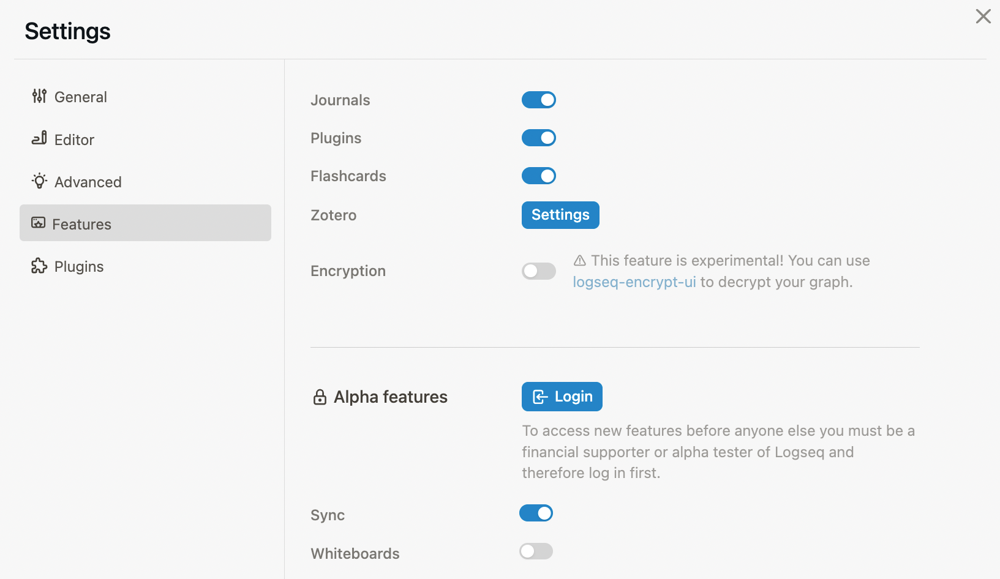
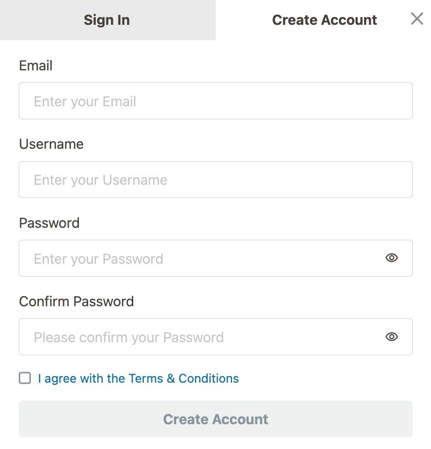
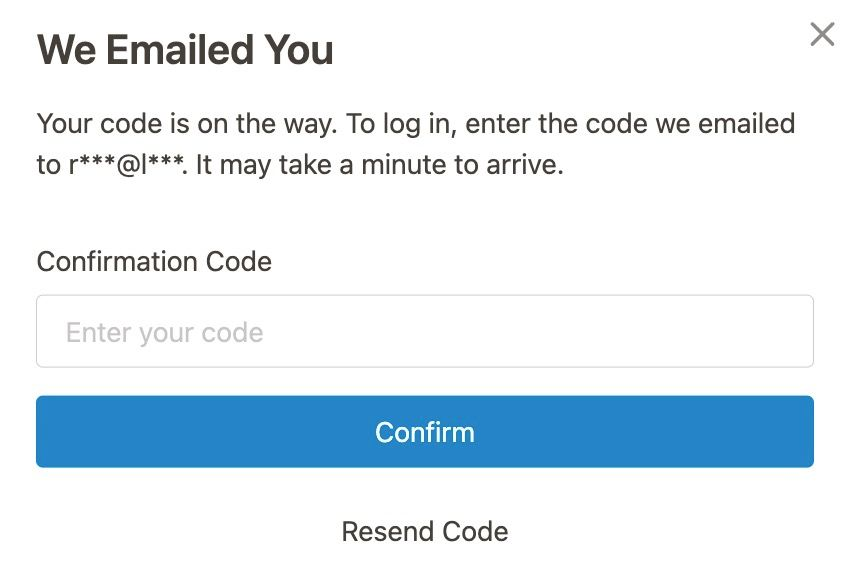

Before you enable Logseq Sync, you first need to **make a backup** of the graph you wish to sync and **move it out of any synced folder**. Don't skip this step, otherwise you might lose some of your notes.

A synced folder is anything that a third-party service like iCloud or Dropbox monitors and backs up to the cloud. From now on, **_only_ Logseq Sync should be syncing your graph.**

If you're using [Logseq on iOS](https://apps.apple.com/us/app/logseq/id1601013908), make sure that your store the graph in the **Logseq** folder _on your iPhone or iPad_. If you store the graph outside of the Logseq folder, you won't be able to use Sync. Don't see the local Logseq folder? Restarting your iOS device will solve the issue.

Once you've ensured your Logseq graph runs fully local, it's time to enable the experimental Sync feature. To do so, go to `Settings` > `Features` and enable the **Sync** toggle. This works on Logseq Desktop, Android, and iOS. However, **we strongly urge you to setup your first remote graph using the desktop app.**

Next, click the `Login` button. You'll see a small window pop up with two tabs: `Sign In` and `Create Account`.

Click the `Create Account` tab and fill in the form to create your account. Make sure to **use the email address you used on Open Collective.**

When you've chosen a username and a secure password, click the `Create Account` button and confirm your account using the verification code you received via email:

Finally, login and return to Logseq.

_If you've just turned Sponsor or Backer, please allow up to an hour for the system to check your credentials and give you access to the next step._

_If you haven't received a verification email within 10 minutes (first check your spam folder), please [contact us](mailto:support@logseq.com) and provide your email address and username._