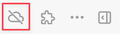
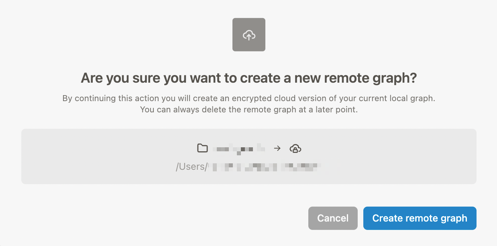
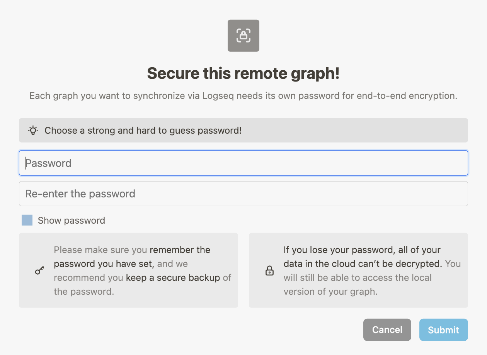

To create a remote graph and start syncing your notes, click the cloud icon in the top menu bar:

_If you don't see the cloud icon, make sure you have a (local) graph open._

Next, you're prompted to setup a new remote graph. Click the `Create remote graph` button:

Finally, set a secure password for your graph (this is different from your account password!) and click the `Submit` button:

_**Note:** Save your password in a secure place, because you can't change it later (nor can we change the password for you)._