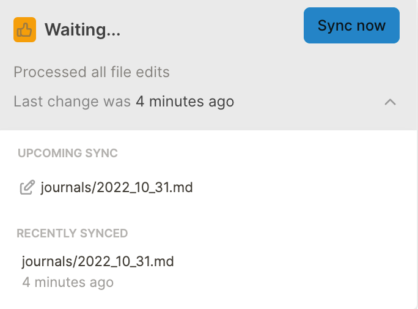
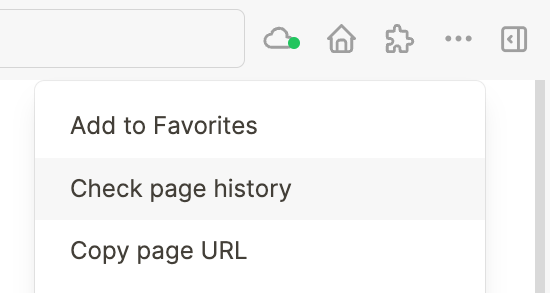

Logseq will automatically keep your graph in sync. When the dot in the cloud icon (in the top bar) is green, it means your graph is fully synced to the cloud. When the dot is orange, it means there are pending changes (either outgoing or incoming).

On mobile, Logseq will sync every two seconds after your stop typing. On desktop, it's currently set to sync 20 seconds after your stop typing.

If you want to force a sync, click the cloud icon and then the `Sync now` button:

At the moment, it's important to keep an eye on the sync status. When you open Logseq, **let it first sync before starting to type**. Otherwise, you might run the risk of overwriting notes in the cloud. That's because currently, Sync works different from Git; it does not compare pages. Instead, it syncs the entire page containing the most recent changes.

In case you do find yourself overwriting a remote change by accident, no worries. Logseq Sync keeps a page history for up to a year. You can access it by going to a page and clicking the `Check page history` button from the menu (`...`):

