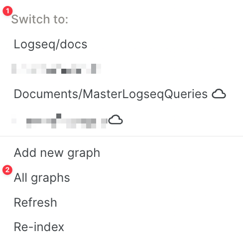
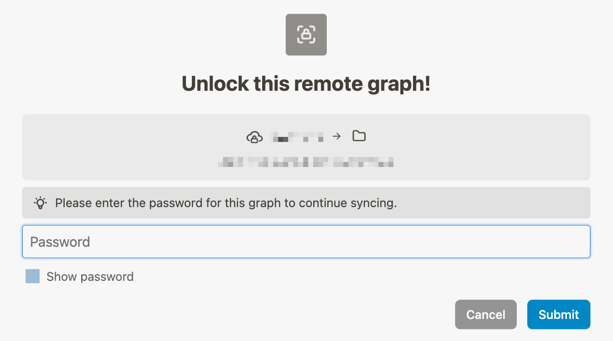

Switching between remote and local graphs is easy. Simply switch graphs via the left sidebar (1) or the _All graphs_ page (2). Remote graphs are indicated by the cloud icon behind their name:

When switching to a remote graph, you'll be prompted to enter its password (this is your _graph_ password, not your account password):

