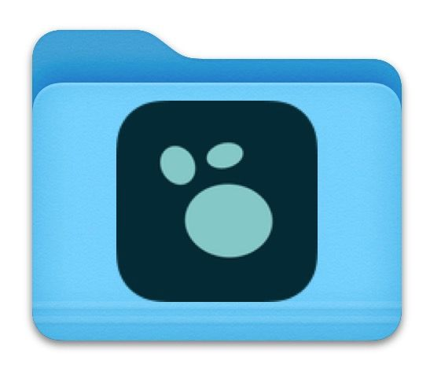

To open your remote graph on a mobile device, make sure you're also logged into Logseq mobile with the same username as you're logged in on your desktop.

The first time you login on mobile, Logseq will likely ask to make your current graph remote. If you already set up your remote graph in the steps before (which we recommend) tap `Cancel`.

Next, open the left sidebar in Logseq mobile and tap your graph name (top left). From the dropdown menu, select your remote graph (recognizable by the cloud icon next to it). Logseq will now ask you to store your remote graph somewhere on your mobile. **Make sure you save it locally, and _not_ in a synced folder.**

Like on desktop, most mobile operating systems come with built-in sync functionality. On Android this is likely Google Drive, and on iOS devices this is iCloud. You should not store your graph in folder synced by these services; pick a **local** folder instead (on iOS it's crucial to create a graph folder within the folder with the Logseq logo, see below).

