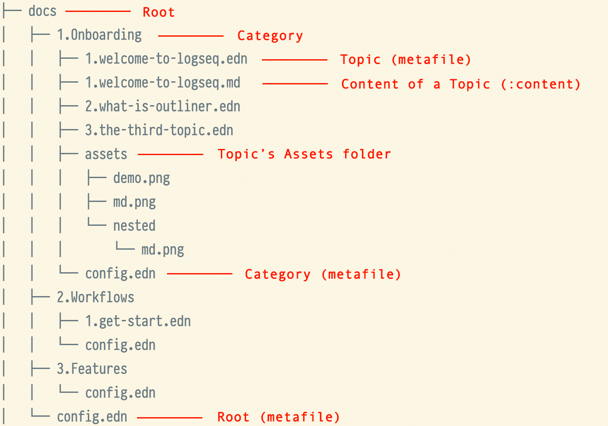

# 📖 Handbook specifications

The current handbook resources are all stored in the `docs` directory.

## Root

In the root directory, there is a global configuration file `docs/config.edn` that describes the basic meta information
of handbook.

```clojure
{:title          "Logseq Handbook"
 :version        "0.0.1"

 ;; [optional] Currently, the children items will be built from categories folders
 ;; :children []

 ;; [optional] popular topics from home
 :popular-topics ["1.Onboarding/1.welcome-to-logseq"]

 ;; more options will be supported ...
 }
```

> ❓As for why `edn` is used as the configuration file format instead of `json`,
> it is mainly because `edn` supports richer data types, as well as comments,
> which are beneficial for future scalability, and writing experience.
> https://github.com/edn-format/edn

## Category

The current top-level grouping of Handbook is abstracted through `Category`,
which are derived from the first level of directories under `docs/*`.
Each Category folder also corresponds to a configuration file `docs/your-category-name/config.edn`,
which is used to configure the meta information of the `category`.

```clojure
{:title       "🔆 Onboarding"
 :description "This is sub description"
 :color       "#dd2624"

 ;; [optional] children as topics, if not set this field,
 ;; the children will be built from all topic metafiles under the category folder
 :children    ["1.welcome-to-logseq"
               "2.what-is-outliner"
               "3.the-third-topic"]
 }
```

## Topic

Each `Category` is composed of one or more `Topics`,
and it's also the unit component of Handbook. Currently, you can create a `topic`
by creating a `docs/category/xxx-topic-file.edn` metafile in the `category` folder.

A sample from `docs/1.Onboarding/1.welcome-to-logseq.edn`

```clojure
{
 ;; [Required] A friendly title for user
 :title       "🙌 Welcome to Logseq"

 ;; [Optional]
 :description "This is a sub description text"

 ;; [Optional] Some images or videos to demonstrate features
 :demos       ["./assets/demo.png"
               ;; support: Local video
               "./assets/x.mp4"
               ;; support: YouTube video
               "https://www.youtube.com/watch?v=uig8_3kqhjY"]

 ;; [Optional] This value will be auto generated from the same name markdown file. `1.welcome-to-logseq.md`
 ;; :content ""

 ;; [Optional] a thumb image for topics list
 :cover       "./assets/demo.png"

 ;; [Optional] children as chapters
 ;; If it is not set, it means that the topic has no subchapter
 :children    ["1.welcome-to-logseq_chapter-1.edn"
               "2.welcome-to-logseq_chapter-2"]
 }
```

### What's a **Chapter**?

A topic can be composed of 0 or more chapters. `Chapter` itself is also a `Topic` type.

### How to write the content of topic?

For the body content of the topic, it is described by the `:content` field.
You can fill this field directly in the metafile, but it may be inconvenient
when the content is too long, so we support that a `.md` file of the same name can also
be used to describe the `:content` field, which will be compiled html string during compilation.

### How to link an asset file?

In order to reduce the complexity of the build logic,
`topic` references to assets files are currently processed by convention.
All assets files must be placed in the `assets` folder under the corresponding `Category`.

> ⚠️ Since all assets files are moved to the same root directory during the build process,
> to prevent overwriting problems with files of the same name,
> you can prevent conflicts by adding a conflict-preventing prefix to the file name.

### A final look at the structures of the `docs` directory!



# 🛠 Set up development mode for previewing in time

#### Infrastructure

The build scripts is powered by Babashka. So you should install it first.  
https://github.com/babashka/babashka#installation

#### Commands

```bash
make dev
```

This command will listen to the file changes under `docs/*`
and build the handbook data to be used by the client.

#### ⚠️ How to publish updates to user?

The project has been configured with Github CI to deploy the latest updates,
which will take effect immediately when the master branch has content changes.
So if you don't want the changes to take effect immediately on the Logseq client,
you can update the content via Github Pull Request.
> Online data source: https://handbooks.pages.dev/handbooks.json

#### Videos

ref link: [🔗 A video to show how to write docs](https://github.com/logseq/handbooks/issues/1)

<video width="100%" height="auto" controls>
  <source src="https://user-images.githubusercontent.com/1779837/217492648-d1cba1ad-9c35-48b2-9ba1-ed26f70b1efd.mp4" type="video/mp4">
</video>