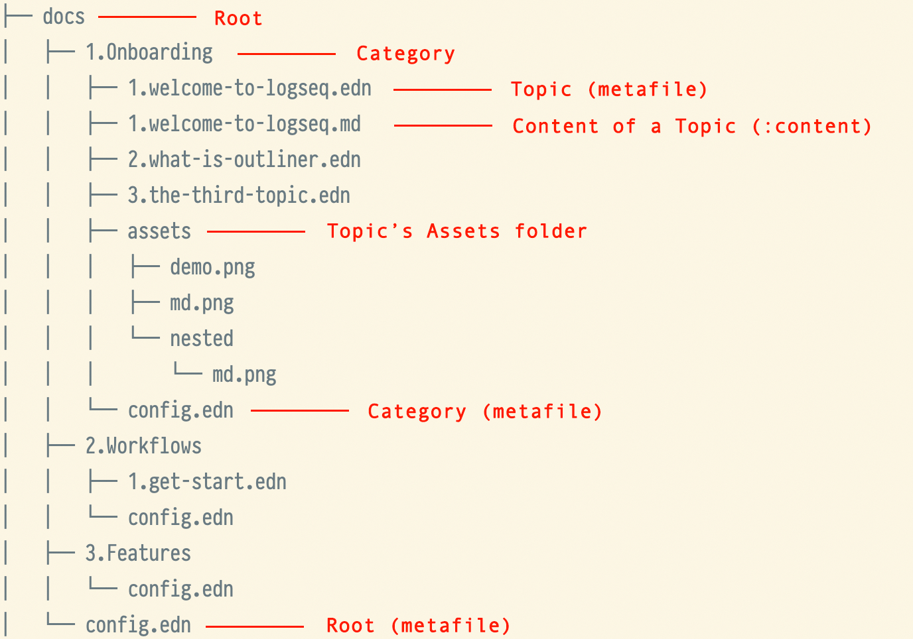

# 📖 Handbooks specifications

The current handbooks resources are all stored in the `docs` directory.

### Root

In the root directory, there is a global configuration file `docs/config.edn` that describes the basic meta information
of handbooks.

```clojure
{:title          "Logseq Handbooks"
 :version        "0.0.1"

 ;; [optional] Currently, the children items will be built from categories folders
 ;; :children []

 ;; [optional] popular topics from home
 :popular-topics ["1.Onboarding/1.welcome-to-logseq"]

 ;; more options will be supported ...
 }
```

> ❓As for why `edn` is used as the configuration file format instead of `json`,
> it is mainly because `edn` supports richer data types, as well as comments,
> which are beneficial for future scalability, and writing experience.
> https://github.com/edn-format/edn

### Categories

The current top-level grouping of Handbooks is abstracted through `Categories`,
which are derived from the first level of directories under `docs/*`.
Each Category folder also corresponds to a configuration file `docs/category/config.edn`,
which is used to configure the meta information of that `category`.

```clojure
{:title       "🔆 Onboarding"
 :description "This is sub description"
 :color       "#dd2624"

 ;; [optional] children as topics, if not set this field,
 ;; the children items will be built from topics meta files
 :children    ["1.welcome-to-logseq"
               "2.what-is-outliner"
               "3.the-third-topic"]
 }
```

### Topics

Each `Category` is composed of one or more `Topics`,
and it's also the unit component of Handbooks. Currently, you can create a `Topic`
by creating a `docs/category/xxx-topic-file.edn` metafile in the `Category` folder.

A sample from `docs/1.Onboarding/1.welcome-to-logseq.edn`

```clojure
{
 ;; [Required] A friendly title for user
 :title       "🙌 Welcome to Logseq"

 ;; [Optional]
 :description "This is a sub description text"

 ;; [Optional] Some images or videos to demonstrate features
 :demos       ["./assets/demo.png"
               ;; support: Local video
               "./assets/x.mp4"
               ;; support: YouTube video
               "https://www.youtube.com/watch?v=uig8_3kqhjY"]

 ;; [Optional] This value will be auto generated from the same name markdown file. `1.welcome-to-logseq.md`
 ;; :content ""

 ;; [Optional] a thumb image for topics list
 :cover       "./assets/demo.png"

 ;; [Optional] children as chapters
 ;; If it is not set, it means that the topic has no subchapter
 :children    ["1.welcome-to-logseq_chapter-1.edn"
               "2.welcome-to-logseq_chapter-2"]
 }
```

> ⚠️What's a **Chapter**?  
> A topic can be composed of 0 or more chapters. Chapter itself is also a Topic type.

##### How to write the content of topic?

For the body content of the topic, it is described by the `:content` field.
You can fill this field directly in the metafile, but it may be inconvenient
when the content is too long, so we support that a `.md` file of the same name can also
be used to describe the `:content` field, which will be compiled html string during compilation.

#### How to link an asset file?

In order to reduce the complexity of the build logic,
`topic` references to assets files are currently processed by convention.
All assets files must be placed in the `assets` folder under the corresponding `Category`.

> ⚠️ Since all assets files are moved to the same root directory during the build process,
> to prevent overwriting problems with files of the same name,
> you can prevent conflicts by adding a conflict-preventing prefix to the file name.

### A final look at the structures of the `docs` directory!



# 🛠 Set up development mode for previewing in time

#### Infrastructure

The build scripts is powered by Babashka. So you should install it first.
https://github.com/babashka/babashka#installation

#### Commands

```bash
make dev
```

This command will listen to the file changes under `docs/*`
and build the handbooks data to be used by the client.